This is an example code to generate avator icon images with an initial alphabet in PHP. The important thing in this repo is centering the initial character of a user.

To use this, you need to install and enable [GD](https://www.php.net/manual/en/book.image.php).

CAUTION: The following images are generated on Windows 11. On other OS, the result should change.

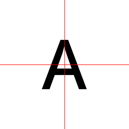
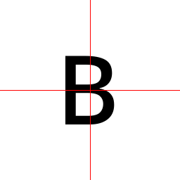
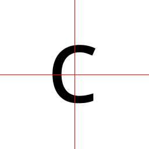
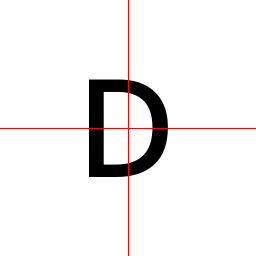
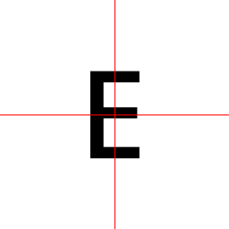
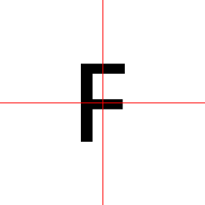
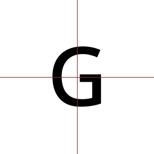
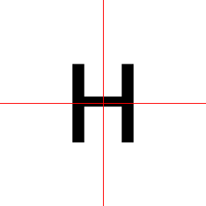
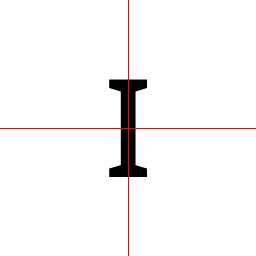
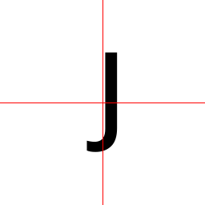
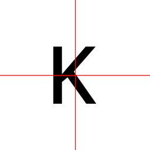
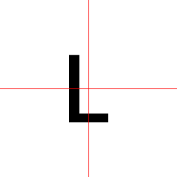
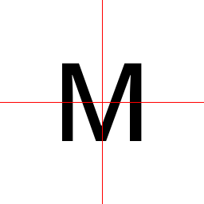
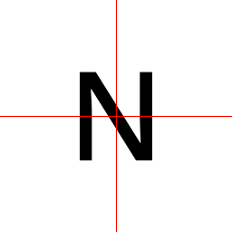
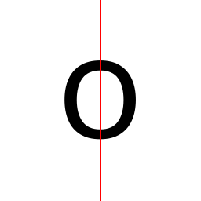
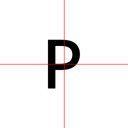
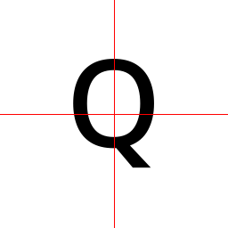
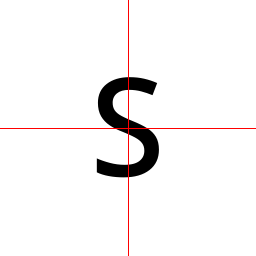
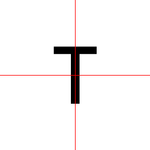
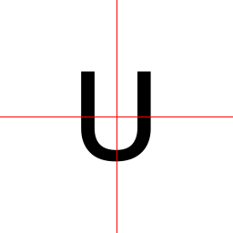
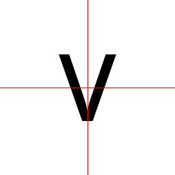
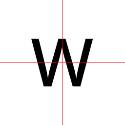
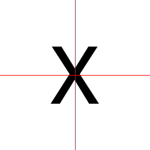
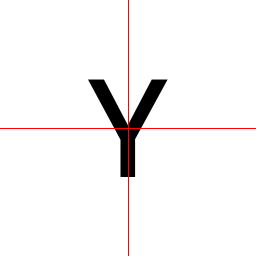
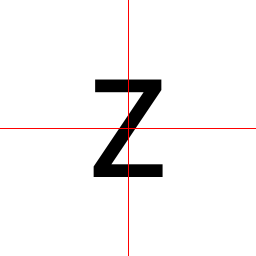